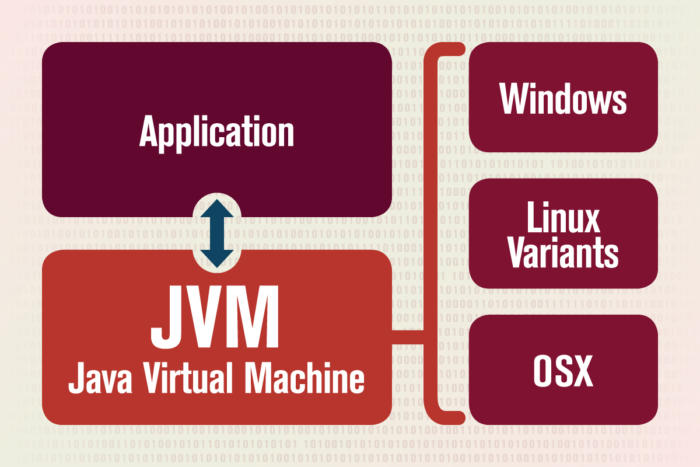

## **My Goal**

---

</br>

- Java 개발자니까 Java 공부
- 깊이가 필요하면 시간 투자를 과감히 -> 나중에 더 돌아가는 길일 수 있음.
- 자바 모듈과 클래스 사용법 정리

</br>
</br>

## **Table of Contents**

---

- [**My Goal**](#my-goal)
- [**Table of Contents**](#table-of-contents)
  - [**JVM**](#jvm)
    - [**JRE, JDK 요약**](#jre-jdk-요약)
    - [**JVM 사용 이유**](#jvm-사용-이유)
    - [**Sequnece 정리**](#sequnece-정리)
    - [**JVM 구조**](#jvm-구조)
    - [**Class Loader**](#class-loader)
    - [**Initialization**](#initialization)
    - [**RunTime Data Area**](#runtime-data-area)
      - [**Execution Engine**](#execution-engine)
    - [**Garbage Collection**](#garbage-collection)
      - [**메모리 누수**](#메모리-누수)
      - [**Garbage 판단 기준**](#garbage-판단-기준)
  - [**접근 제어자**](#접근-제어자)
  - [**자료형**](#자료형)
  - [**상속**](#상속)
  - [**추상 클래스와 인터페이스 차이**](#추상-클래스와-인터페이스-차이)
  - [**추상 클래스와 인터페이스 차이 예제**](#추상-클래스와-인터페이스-차이-예제)
  - [**Enum**](#enum)
  - [**String StringBuilder StringTokenizer**](#string-stringbuilder-stringtokenizer)
    - [String](#string)
    - [StringBuilder](#stringbuilder)
    - [StringTokenizer](#stringtokenizer)
  - [**Optional**](#optional)
  - [**Serializable-직렬화와 역직렬화**](#serializable-직렬화와-역직렬화)
    - [**Json 직렬화 사용하기**](#json-직렬화-사용하기)
    - [**직렬화 사용시 유의 사항**](#직렬화-사용시-유의-사항)
  - [**Exception**](#exception)
  - [예외 처리 종류](#예외-처리-종류)
  - [예외 처리 잘하는 방법](#예외-처리-잘하는-방법)

</br>
</br>

### **JVM**

</br>

#### **JRE, JDK 요약**

- 자바 프로그램을 개발 하기 위해 JAVA SE(자바 구현체)인 JRE나 JDK 필요

|                JRE                |           JDK           |
| :-------------------------------: | :---------------------: |
|          자바 실행 환경           |     자바 개발 키트      |
| JVM + 자바 표준 클래스 라이브러리 | JRE + Tools & Tool APIs |

> - JRE는 실행 환경만을 제공 하고 그 이외에 컴파일 및 tool 명령어 제공 X
> - JDK는 JRE를 포함하며 javac, jar 등의 tool api를 제공.

</br>

#### **JVM 사용 이유**

</br>



> - .java를 바로 binary code(기계어)로 변환 할 경우 -> **`다른 OS에서는 실행 할 수 없음.`**
> - JVM은
>   compile time에서 **.java -> .class(바이트 코드)** 변환
>   변환 한 **.class(바이트 코드를) runtime에서 넘겨 받은 후**
>   각 **OS에 맞게 binary code로 해석.**
> - 즉, 자바 파일이 OS에 종속적이지 않게 해주도록 하는 것이 JVM의 역할

</br>

#### **Sequnece 정리**

</br>


</br>

|              |        Action         |                 Description                  |
| :----------: | :-------------------: | :------------------------------------------: |
| compile time |   .java -> . class    |           소스 코드 -> 바이트 코드           |
|   Run time   | .class -> binary code | JVM에서 바이트 코드 -> OS 맞는 바이나리 코드 |

</br>

#### **JVM 구조**

</br>


</br>

#### **Class Loader**

</br>

> - JVM은
>   - Class lodaer에서 .class를 load하고 -메모리에 적재하는 작업을 수행

</br>

- **Loading**

</br>

|      Name       |                    Description                     |
| :-------------: | :------------------------------------------------: |
|  Bootstrap CL   | rt.jar에 담긴 클래스 load, 가장 최상위 클래스 로더 |
|  Extension CL   |         JDK Extension library 클래스 load          |
| Application CL  |      ($classpath$)어플리 케이션의 클래스 로드      |
| User-Defined CL |          개박자가 직접 생성한 클래스 로드          |

</br>

- **Linking**

</br>

|     Name     |                                Description                                 |
| :----------: | :------------------------------------------------------------------------: |
| Verification |                         .class 파일의 정확성 보장                          |
| Preparation  | JVM이 메모리를 기본 값 초기화 후, 클래스 변수(static)들을 위한 메모리 할당 |
|  Resolution  |                   Symbolic reference -> direct reference                   |

</br>

> Symbolic referecne는 primitive를 제외한 모든 타입을 명시적 주소 기반의 레퍼런스가 아닌
> Symbolic reference를 통해 참조.

</br>

#### **Initialization**

</br>

- static 값 초기화 및 변수 할당
- static initializer 실행

> - 단 한 번 실행
>   - 해당 클래스의 객체 생성 할 때
>   - 해당 클래스의 static 변수에 최초 접근 할 때,(즉 객체를 생성하지 않았더라도 실행)

</br>

#### **RunTime Data Area**

</br>

> - JVM이 프로그램을 실행하기 위해 OS로부터 할당 받은 메모리 공간
> - 추후 JVM 튜닝 공부 요망(2022.02.10)

</br>

|         Name         |                                                   Description                                                   |
| :------------------: | :-------------------------------------------------------------------------------------------------------------: |
|     Method Area      |                                  클래스 파일, 인터페이스, 메서드, static, 필드                                  |
|         Heap         |                                                 객체, 인스턴스                                                  |
|        Stack         | JVM thread를 위한 공간, 메소드 호출 될 때 frame 생성. 메소드 상태 정보 저장, 쓰레드 종료시 runtime stack 사라짐 |
|     PC register      |                               thread에서 현재 실행할 스택 프레임 가리키는 포인터                                |
| Native Method Stacks |                            thread에서 native method가 호출 될 때 저장, JNI(c,c++ 등)                            |

</br>

##### **Execution Engine**

|         Name          |                                Description                                 |
| :-------------------: | :------------------------------------------------------------------------: |
|      Interpreter      | 바이트 코드를 네이티브 코드로 변경시키면서 실행, 반복되는 코드 발견 -> JIT |
|     JIT Compiler      |                 반복되는 코드를 모두 네이티브 코드로 변경                  |
|   Garbage Collector   |                더이상 참조 하지 않은 객체를 메모리에서 해제                |
|          JNI          |                   c나 c++로 된 함수를 사용 가능하게 만듦                   |
| Native Method Library |                         c, c++로 작성된 라이브러리                         |

</br>

#### **Garbage Collection**

> - 프로그램 실행 시 OS가 JVM에 메모리 할당
>   - 할당 받은 것 이상 사용 -> 에러, 프로그램 종료
>   - 즉, 현재 프로세스에서 메모리 누수 발생 하여도 실행 종료 될 뿐 영향 X

</br>

##### **메모리 누수**

</br>


> - Memory의 heap 영역에 할당된 부분 참조 X -> but 해제되지 않은 채로 메모리 점유
> - JVM의 run time data areas는 WAS에서 빈번하게 성능 이슈

</br>

##### **Garbage 판단 기준**

</br>

> - Reachability
>   - 스택 영역의 Java 메서드 내에서 실행하는 지역 변수, 파라미터, 연산 작업중 피연산자에 의한 참조
>   - 메서드 영역의 상수 풀이나 정적 변수에 의한 참조
>   - 메모리에 남아있는 JNI에 의해 생성된 객체에서 참조

</br>

- [To.목차](#table-of-contents)

</br>
</br>
</br>

### **접근 제어자**

</br>

| 접근제어자 | 동일 패키지 |             다른 패키지              | 클래스 내부 |
| :--------: | :---------: | :----------------------------------: | :---------: |
|  private   |      X      |                  X                   |      O      |
|  default   |      O      |                  X                   |      O      |
| protected  |      O      | X (상속 받아서 사용하는 경우는 가능) |      O      |
|   public   |      O      |                  O                   |      O      |

</br>

- Access1으로 test해보기

```java

package com.java.skill.accessmodifier.base;

public class Access1 {

    private String secret; // class 내부에서만 사용 가능
    String basic; // 해당 패키지에서는 접근 가능
    protected String protect; // 해당 패키지의 클래스 or 상속받은 클래스에서만 접근 가능

}

```

- 동일 패키지의 다른 클래스 접근

```java

package com.java.skill.accessmodifier.base;

public class Practice {
    public static void main(String[] args) {

        Access1 access1 = new Access1();
        // has private access -> 같은 패키지여도 다른 클래스
//        access1.secret;

        // default로 동일 package에서는 접근 가능
        System.out.println(access1.basic);

        // protected 동일 package에서 접근 가능
        System.out.println(access1.protect);

    }

}

```

</br>

> accessmodifier.base로 동일 package  
> private은 접근 불가  
> protected와 default는 접근 가능

</br>

- 다른 패키지 접근

```java

package com.java.skill.accessmodifier.other;
import com.java.skill.accessmodifier.base.Access1;

public class Practice2 {
    public static void main(String[] args) {
        Access1 access1 = new Access1();

        // has protected access -> 다른 패키지
//        access1.protect;

        // is not public -> 다른 패키지
//        access1.basic;
    }
}

```

</br>

> 다른 패키지에서는  
> private, default, protected 모두 접근 불가

</br>

- 다른 패키지, 상속받은 클래스 접근

```java

package com.java.skill.accessmodifier.other;
import com.java.skill.accessmodifier.base.Access1;

public class Access2 extends Access1{

    public static void main(String[] args) {
        Access2 access2 = new Access2();
        // 상속 받은 클래스에서는 패키지 달라도 가능
        access2.protect = "child class possible";
        System.out.println(access2.protect);
    }
}


```

</br>

> 다른 패키지에서 protected 접근제어자는 접근 불가능  
> but, `해당 클래스를 상속받은 클래스`는 다른 패키지더라도 접근 가능

</br>
</br>
</br>

### **자료형**

</br>

</br>
</br>
</br>

### **상속**

</br>

> 게임에서 유저가 있다  
> 게임에서 유저(부모)는 전직할 수 있다.(자식 - 마법사)
> 마법사는 유저(부모)의 기능을 사용할 수 있다.

</br>

```java

package practice.basicjava.inheritance;

import lombok.Getter;
import lombok.Setter;

@Getter
@Setter
public class User {

    protected String name;
    protected String job;

    protected User(String name,String job) {
        this.name = name;
        this.job = job;
    }

    protected void move(){
        System.out.println("이동 합니다.");
    }
    protected void basicAttack(){
        System.out.println("기본 공격을 합니다.");
    }
}

```

</br>

```java

package practice.basicjava.inheritance;

public class Wizard extends User{

    public Wizard(String name, String job) {
        super(name, job);
    }

    public void magicAttack(){
        System.out.println("마법 공격을 실행합니다.");
    }

    public void teleport(){
        System.out.println("텔레포트로 이동합니다.");
    }

}


```

</br>

> wizard는 user의 하위 개념
> wizard 객체를 user자료형으로 사용할 수 있지만 반대는 X
> wizard 객체를 user자료형으로 사용할 경우 wizard 메서드 사용 불가

</br>
</br>
</br>

### **추상 클래스와 인터페이스 차이**

</br>

> 쓰이는 용도가 다름  
> Abstract는 상속 받는 클래스들의 분류  
> Inteface는 클래스들의 동일 역할 소유

</br>

### **추상 클래스와 인터페이스 차이 예제**

</br>

```java

public abstract class Unit {

    protected String name;

    public Unit(String name){
        this.name = name;
    }

    public void move(){
        System.out.println(name + " unit이 움직입니다.");
    }

    public abstract void attack();

}

```

</br>

```java

package practice.basicjava.abstractandinterface;

public interface Flyable {

    public void fly();
}


```

</br>

```java

package practice.basicjava.abstractandinterface;

public interface Swimable {

    public void swim();
}


```

</br>

```java
package practice.basicjava.abstractandinterface;

public interface Walkable {

    public void walk();
}

```

</br>

```java

package practice.basicjava.abstractandinterface;

public class FlyUnit extends Unit implements Flyable, Walkable{

    public FlyUnit(String name) {
        super(name);
    }

    @Override
    public void attack() {
        System.out.println(name + "이 공중 공격을 시작합니다.");
    }

    @Override
    public void fly() {
        System.out.println(name + " 공중 유닛이 날기 시작합니다 .");
    }

    @Override
    public void walk() {
        System.out.println(name + " 공중 유닛이 걷기 시작합니다.");
    }
}


```

</br>

```java

package practice.basicjava.abstractandinterface;

public class AquaUnit extends Unit implements Walkable, Swimable{

    public AquaUnit(String name) {
        super(name);
    }

    @Override
    public void swim() {
        System.out.println(name + "수중 유닛이 잠수를 시작합니다.");
    }

    @Override
    public void attack() {
        System.out.println(name + "이 수중 공격을 시작합니다.");
    }

    @Override
    public void walk() {
        System.out.println(name + " 수중 유닛이 걷기 시작합니다.");
    }
}


```

</br>

```java

package practice.basicjava.abstractandinterface;

public class LandUnit extends Unit implements Walkable{

    public LandUnit(String name) {
        super(name);
    }

    @Override
    public void attack() {
        System.out.println(name + "이 지상 공격을 시작합니다.");
    }

    @Override
    public void walk() {
        System.out.println(name + " 지상 유닛이 걷기 시작합니다.");
    }
}


```

</br>
</br>
</br>

### **Enum**

</br>

- class : java.lang.Enum;
  - Enum class 안에 조작할 수 있는 메소드 포함.

</br>

- method

  |     메서드      |               기능               |
  | :-------------: | :------------------------------: |
  | Enum.ordinal()  | enum 상수값의 index를 int로 반환 |
  |   Enum.name()   |   enum 상수를 string으로 반환    |
  | Enum.toString() |   enum 상수를 string으로 반환    |
  |  Enum.values()  |      enum type 배열로 반환       |

</br>

- 예시 (skill/src/main/java/com/java/skill/Enum)

```java
public enum Direction {
    // 명시적 index 설정
    // UP(2), RIGHT(5), DOWN(6), LEFT(8);

    // 상수의 index 값은 0,1,2... 오름차순 증가로 설정
    UP, RIGHT, DOWN, LEFT;

}

public class EnumPractice {
    public static void main(String[] args) {

        // Enum.values() : Enum 타입의 모든 상수 저장하는 배열
        Direction[] directions = Direction.values();

        // Direction 타입으로 출력
        for (Direction direction : directions) {
            System.out.println(direction);
        }

        // Direction을 Integer List로
        List<Integer> arrInteger = Arrays.stream(directions)
                .map(Enum::ordinal)
                .collect(Collectors.toList());
        System.out.println(arrInteger);

        // Enum 상수의 index를 int로 반환. -> 2출력
        int ordinalDown = Direction.DOWN.ordinal();
        System.out.println(ordinalDown);

        // Enum 타입의 키워드를 string으로 반환
        String nameDown = Direction.DOWN.name();
        System.out.println(nameDown);

        // Enum 타입의 키워드를 string으로 반환
        String toStringDown = Direction.DOWN.toString();
        System.out.println(toStringDown);
    }
}
```

</br>

- [To.목차](#table-of-contents)

</br>
</br>
</br>

### **String StringBuilder StringTokenizer**

---

</br>

#### String

</br>

|           메서드           |                                         기능                                         |
| :------------------------: | :----------------------------------------------------------------------------------: |
|  replace(target,replace)   |                            target 문자열을 replace로 대체                            |
|        split(regex)        | regex 기준으로 나눈 후 문자열 배열 저장, 특정 regex가 연속일 경우 중간에 공백 들어간 |
|    startsWith("prefix")    |                            접두로 시작하는지 boolean 반환                            |
|     endsWith("suffix")     |                             접미로 끝나는지 boolean 반환                             |
|  equals("compareString")   |                        compareString이랑 같은지 boolean 반환                         |
| string.compareTo("target") |                     문자열 비교, string이 크면 음수, 작으면 양수                     |
|   substring(start,end+1)   |                           start~end(포함)까지 문자열 반환                            |

</br>

```java

public class StringPractice {
    public static void main(String[] args) {
        String str = "abcddddeeee";

        //defddddeeee
        String str2 = str.replace("abc","def");
        System.out.println(str2);

        // d를 기준으로 나누기, 그러나 d가 연속적임으로 공백이 추가 됨
        String[] strings = str.split("d");

        /// abc, (공백), (공백), (공백), eeee 출력
        for (String string: strings) {
            System.out.println(string);
        }

        // 길이
        System.out.println(str.length());

        // true
        System.out.println(str.startsWith("a"));

        // false
        System.out.println(str.endsWith("f"));

        // true
        System.out.println(str.equals("abcddddeeee"));

        // 음수일 경우 기준 string이 더큼
        // 헷갈리면 아스키 코드 (기준 - 비교대상) 값
        if(str.compareTo("bcd")>0){
            System.out.println("str이 bcd보다 작다.");
        }
        else{
            System.out.println(str.compareTo("bcd"));
            System.out.println("str이 bcd보다 크다");
        }

        // dddd 출력
        // substring(start, end+1)
        System.out.println(str.substring(3,7));
    }
}
```

</br>

#### StringBuilder

</br>

|      메서드       |            기능            |
| :---------------: | :------------------------: |
| append(type 다양) |        문자열 추가         |
|    toString()     | 추가 된 문자열 합쳐서 반환 |
| delete(start,end) |    start~end-1까지 삭제    |
|     length()      | 추가된 문자열의 길이 반환  |

</br>

> - stringBuilder는 immutable한 string의 단점을 보완
> - stringBuilder는 muttable 객체
> - append는 추가되는 원소의 다양한 자료형을 지원(int,float,char 등등)
> - length는 추가되는 횟수의 길이가 아님. 배열의 의미와 다름.

```java

public class StringBuilderPractice {

    public static void main(String[] args) {

        String str = "abcde";
        StringBuilder sb1 = new StringBuilder();
        StringBuilder sb2 = new StringBuilder(str);

        // 1.4abc2c
        sb1.append(1.4);
        sb1.append("abc");
        sb1.append(2);
        sb1.append('c');

        //abcde 출력
        System.out.println(sb2.toString());
        String str2 = sb1.toString();
        System.out.println(str2);

        // start ~ end-1까지 삭제
        //
        sb1.delete(1,2);

        // 14abc2c -> length 7
        System.out.println(sb1.length());

        // abcde  -> length 5
        System.out.println(sb2.length());

        // 14abc2c
        System.out.println(sb1.toString());

        // 음수로 sb1이 더 큼
        // -48 출력
        System.out.println(sb1.compareTo(sb2));


        //14def2c 출력 (start, end+1, 대체할 스트링)
        sb1.replace(2,5,"def");
        System.out.println(sb1.toString());

    }
}
```

</br>

#### StringTokenizer

</br>

|     메서드      |              기능              |
| :-------------: | :----------------------------: |
| hasMoreTokens() | 토큰이 남아있는지 boolean 반환 |
|  countTokens()  |      남아있는 토큰의 개수      |
|   nextToken()   |     다음 토큰 문자열 반환      |

</br>

> - 생성시 delim을 지정할 수 있다.
> - string의 split과 다르게 delim이 여러개 붙어 있어도, 공백을 추가시키지 않음.

```java

import java.util.StringTokenizer;

public class stringTokenizerPractice {
    public static void main(String[] args) {

        String str = "i0am00a00...";
        String str2 = "i am  a  ...";

        // delim 기준 설정
        StringTokenizer st = new StringTokenizer(str,"0");

        // default는 공백 기준으로
        StringTokenizer st2 = new StringTokenizer(str2);

        // str : i am a ...
        // str2 : i am a...
        while(st.hasMoreTokens() && st2.hasMoreTokens()){

            // 남아 있는 token 개수
            System.out.println(st.countTokens());
            System.out.println(st2.countTokens());

            String s1 = st.nextToken();
            String s2 = st2.nextToken();

            System.out.println(s1);
            System.out.println(s2);

            if(s1.equals(s2))
                System.out.println("is same");
        }
    }
}

```

</br>

- [To.목차](#table-of-contents)

</br>
</br>
</br>

### **Optional**

</br>

> - null을 가질 가능성을 가진 객체를 Wrapper로 담은 후 runtime시 발생되는 NPE를 체크하고 다루기 위해 나온 Wrapper 클래스.
> - NPE 발생을 개발자가 처리 X -> Optional로 위임.

</br>

[Optionla API 문서](https://docs.oracle.com/javase/9/docs/api/java/util/Optional.html)

- 요약
  - Optional은 반환값이 없음을 명확하게 표현
  - 즉 반환타입을 Optional로 사용하자고 한 것
  - 또 Optional null로 감싸는 것이 아니라 인스턴스를 바라 봐야한다는 것.

</br>

- Optional에 대한 고찰

</br>

> - API가 그렇듯 Optional도 쓰는 사람의 책임에 달려있다.
> - Optional은 직접적으로 null로 감싸지 않는다.
>   - 반환값 받은 후(사용하는 사람에 따라 다르지만)
>   - null일 경우 (이게 의도한 방식)
>     - 객체 생성 or 사용자가 지정한 객체
>     - 액션 지정
>   - 혹시나 반환 받을 객체를 직접적으로 써야할 경우
>     - null 체크 후 객체 받아오기

</br>

- Optional을 인자로 받는 것이 아닌 Optional 반환타입으로만 쓰는 이유

</br>

> - 반환 받은 Optional 인스턴스를 이용해 바로 액션
> - try catch, if else 문보다 유지보수 용이
>   - stream, fileter, flatmap등으로 chaining 가능.

- 예시

```java

```

```java

```

</br>

- [To.목차](#table-of-contents)

</br>
</br>
</br>

### **Serializable-직렬화와 역직렬화**

</br>

|                    직렬화와 역직렬화                    |
| :-----------------------------------------------------: |
|  |

</br>

- 직렬화

> 자바 시스템 내부에서 사용되는 객체 또는 데이터를  
> 외부의 자바 시스템에서도 사용 할 수 있도록  
> byte형태로 데이터를 변환하는 기술

</br>

- 역직렬화

> 바이트로 변환된 데이터를 다시 객체로 변환하는 기술

</br>

#### **Json 직렬화 사용하기**

</br>

```java

// build.gradle에 jaskson 추가

implementation 'com.fasterxml.jackson.core:jackson-databind:2.11.4'

```

</br>

```java

package practice.basicjava.serializable;

import lombok.Data;

import java.io.Serializable;

@Data
public class Member implements Serializable {

    private static final long serialVersionUID = 1L;

    String name;
    Long age;
    transient String password;

    public Member(String name, Long age, String password) {
        this.name = name;
        this.age = age;
        this.password = password;
    }

    public Member() {

    }
}


```

</br>

```java

package practice.basicjava.serializable;

import com.fasterxml.jackson.databind.MapperFeature;
import com.fasterxml.jackson.databind.ObjectMapper;

import java.io.File;
import java.io.IOException;

public class ImplMember {

    public static void main(String[] args) throws IOException {

        String path = "./src/main/java/practice/basicjava/serializable/test.json";

        ObjectMapper mapper = new ObjectMapper();

        Member member = new Member("jung",28L,"5678");

        mapper.configure(MapperFeature.PROPAGATE_TRANSIENT_MARKER,true);
        mapper.writeValue(new File(path),member);

        System.out.println(mapper.readValue(new File(path), new Member().getClass()));
    }
}


```

- Serializable interface 상속 받기
- 대상 객체의 serialVersionUID가 동일 해야 역직렬화시 올바르게 적용(시스템이 다를 수 있다는 것을 고려)
- transient 키워드는 직렬화 대상 제외
- 역직렬화 시 데이터타입이 자동으로 맞춰지기 때문에 기존 객체처럼 바로 사용 가능한 장점

</br>

#### **직렬화 사용시 유의 사항**

- 외부 저장소로 저장되는 데이터의 만료 기간이 길 경우 직렬화 사용 지양
- 역직렬화시 예외 발생을 고려하고 개발
- 자주 변경되는 비즈니스적 데이터는 직렬화에 적합하지 않음
- 긴 만료 시간을 가질 경우 json과 같은 데이터 타입이 적절

</br>
</br>
</br>

### **Exception**

</br>

- Error

> 시스템에 비정상적 상황이 생겼을 때 발생,  
> 시스템 레벨에서 발생함으로 심각한 오류  
> 개발자가 미리 예측하여 처리할 수 없음

</br>

- Exception

> 개발자가 구현한 로직에서 발생  
> 즉, `예외가 발생할 상황을 미리 예측하여 개발자가 처리 가능`

</br>

|               Error - Exception 계층                |
| :-------------------------------------------------: |
|  |

</br>

|                            |     Checked Exception     |                                Uncheked Exception                                |
| :------------------------: | :-----------------------: | :------------------------------------------------------------------------------: |
|         처리 여부          |     반드시 예외 처리      |                                명시적 처리 강제 X                                |
|         확인 시점          |        컴파일 단계        |                                   런타임 단계                                    |
| 예외 발생 시 트랜잭션 처리 |        roll-back X        |                                   roll-back O                                    |
|         대표 예외          | IOException, SQLException | NullPointer, IllegalArgumentException, IndexOutOfBoundException, SystemException |

</br>

### 예외 처리 종류

</br>

- 예외 복구 : 다른 작업 흐름으로 유도
- 예외처리 회피 : 처리하지 않고 호출한 쪽으로 throw
- 예외 전환 : checkedException과 같은 exception을 정확한 의미의 예외로 전환 후 throw

</br>

### 예외 처리 잘하는 방법

</br>

- 리소스 정리

> try-catch 구문에서 리소스를 열었으면 finally에서 리소스를 정리하거나,  
> try-with-resource 구문 사용하기

</br>

- 더 자세한 예외로 명시해주기

> 메소드에서 발생할 수 있는 예외를 최대한 자세한 예외로 명시하기

</br>

```java

public void exceptableMethod throw Exception;
public void exceptableMethod throw NumberFormatException; // 좋은 예

```

</br>

- 메시지 자세하게 적기

</br>

- catch 절 순서는 좀 더 상세한 예외부터 처리하는 방식으로

</br>

- Throwable은 catch X

> 예외뿐만 아니라 에러도 잡아서 처리하여 JVM에서 예상치 못한 동작 실행 할 수 있음

</br>

- 예외를 먹지 마라

```java

try{

}catch(Exception e){
    ???
}

```

> 예외 처리 하지 않을거면 하지 않던가  
> log라도 찍던가  
> 주석으로 왜 ignore 하는지

</br>

- 로그 찍고 다시 던지지 마라

</br>

```java
try{
    new Long("xyz");
}catch(NumberFormatException e){
    log.error(e); // log 찍고 던지기
    throw e;
}
```

</br>

> 로그가 너무 자주 찍혀 가독성 훼손 우려  
> 위의 상황 처럼 상위로 Throw할 경우 컨텍스트를 남기고 싶다면  
> 차라리 예외를 래핑해서 새로운 클래스를 만들고  
> 컨텍스트에 대한 정보를 담아 상위로 던져야 한다.

</br>

- 예외를 래핑할 경우 Cause 예외를 담아서 던져라

</br>

```java
    try{
        method();
    }catch(NumberFormatException e){
        throw new MyException("New Message", e);
    }
```
